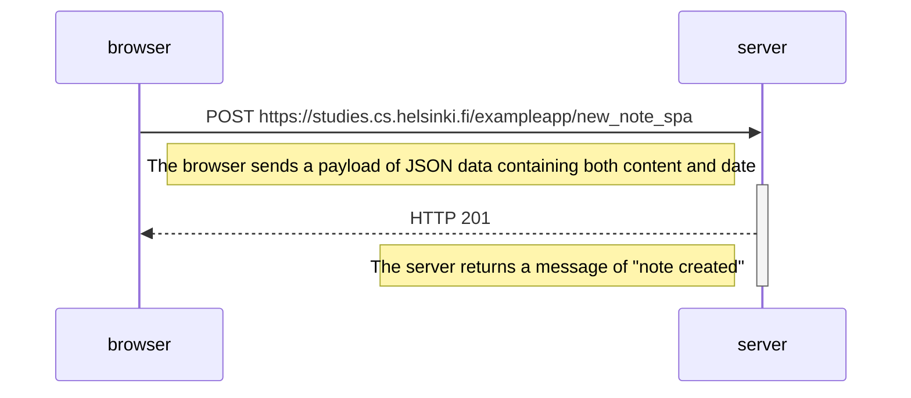

# Exercise 0.6: Creating new note in single-page app

```mermaid
sequenceDiagram
    browser->>server: POST https://studies.cs.helsinki.fi/exampleapp/new_note_spa
    Note right of browser: The browser sends a payload of JSON data containing both content and date
    activate server
    server-->>browser: HTTP 201
    Note left of server: The server returns a message of "note created"
    deactivate server
```